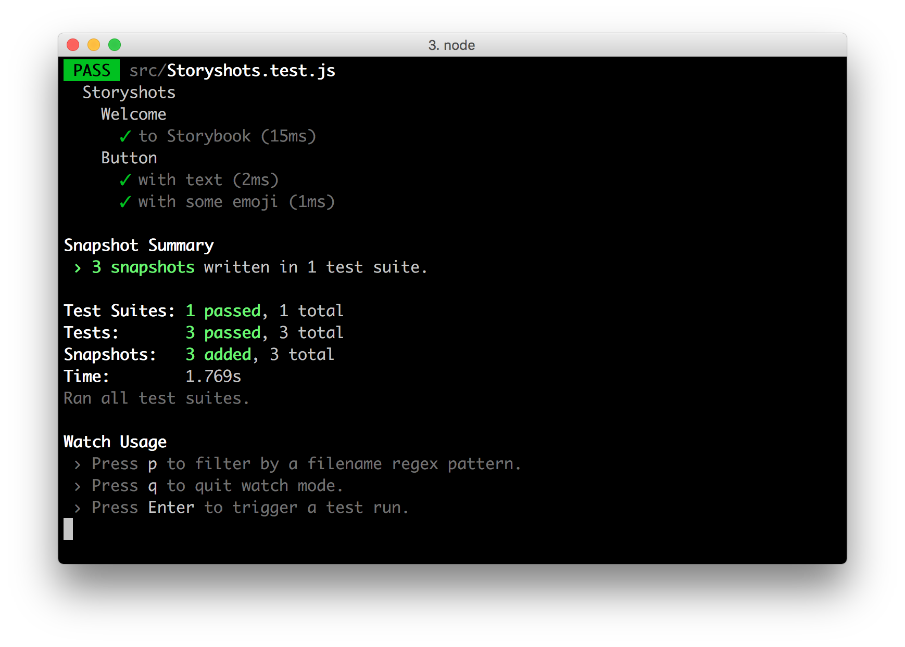

# StoryShots
[](https://greenkeeper.io/)
[](https://travis-ci.org/storybooks/storybook)
[](https://www.codefactor.io/repository/github/storybooks/storybook)
[](https://snyk.io/test/github/storybooks/storybook/8f36abfd6697e58cd76df3526b52e4b9dc894847)
[](https://bettercodehub.com/results/storybooks/storybook) [](https://codecov.io/gh/storybooks/storybook)
[](https://storybooks-slackin.herokuapp.com/)

StoryShots adds automatic Jest Snapshot Testing for [Storybook](https://storybooks.js.org/).

This addon works with Storybook for:
[React](https://github.com/storybooks/storybook/tree/master/app/react) and
[React Native](https://github.com/storybooks/storybook/tree/master/app/react-native).


To use StoryShots, you must use your existing Storybook stories as the input for Jest Snapshot Testing.

## Getting Started

Add the following module into your app.

```sh
npm install --save-dev @storybook/addon-storyshots
```

## Configure your app for Jest

Usually, you might already have completed this step. If not, here are some resources for you.

* If you are using Create React App, it's already configured for Jest. You just need to create a filename with the extension `.test.js`.
* Otherwise check this Egghead [lesson](https://egghead.io/lessons/javascript-test-javascript-with-jest).

## Configure Storyshots

Create a new test file with the name `Storyshots.test.js`. (Or whatever the name you prefer).
Then add following content to it:

```js
import initStoryshots from 'storyshots';

initStoryshots();
```

That's all.

Now run your Jest test command. (Usually, `npm test`.) Then you can see all of your stories are converted as Jest snapshot tests.



## Options

### `configPath`

By default, Storyshots assumes the config directory path for your project as below:

* Storybook for React: `.storybook`
* Storybook for React Native: `storybook`

If you are using a different config directory path, you could change it like this:

```js
initStoryshots({
  configPath: '.my-storybook-config-dir'
});
```

### `suit`

By default, Storyshots groups stories inside a Jest test suit called "Storyshots". You could change it like this:

```js
initStoryshots({
  suit: 'MyStoryshots'
});
```

### `storyKindRegex`

If you'd like to only run a subset of the stories for your snapshot tests based on the story's kind:

```js
initStoryshots({
  storyKindRegex: /^MyComponent$/
});
```

This can be useful if you want to separate the snapshots in directories next to each component. See an example [here](https://github.com/storybooks/storybook/issues/892).

### `storyNameRegex`

If you'd like to only run a subset of the stories for your snapshot tests based on the story's name:

```js
initStoryshots({
  storyNameRegex: /buttons/
});
```
